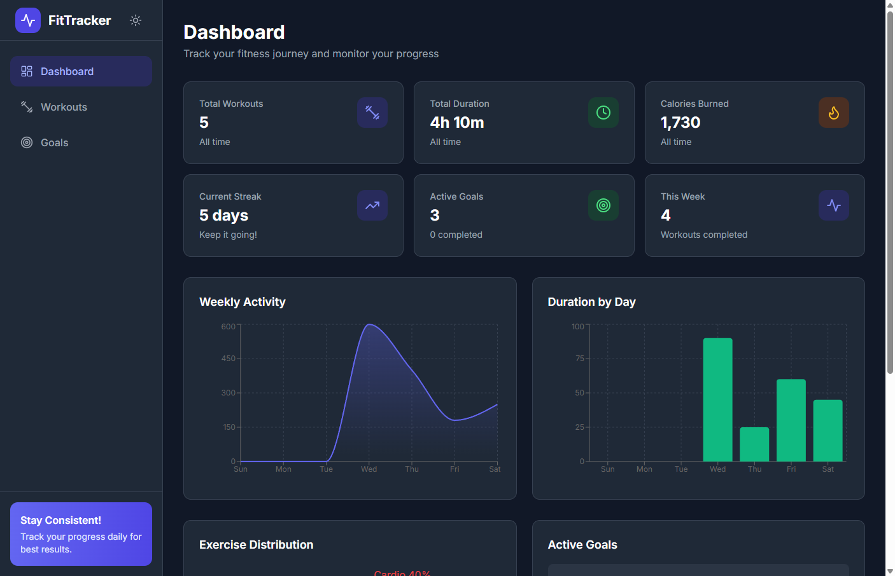
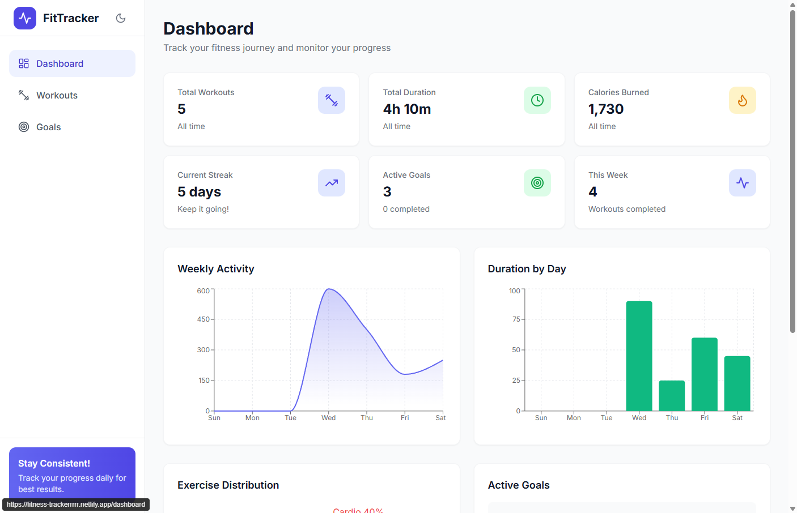
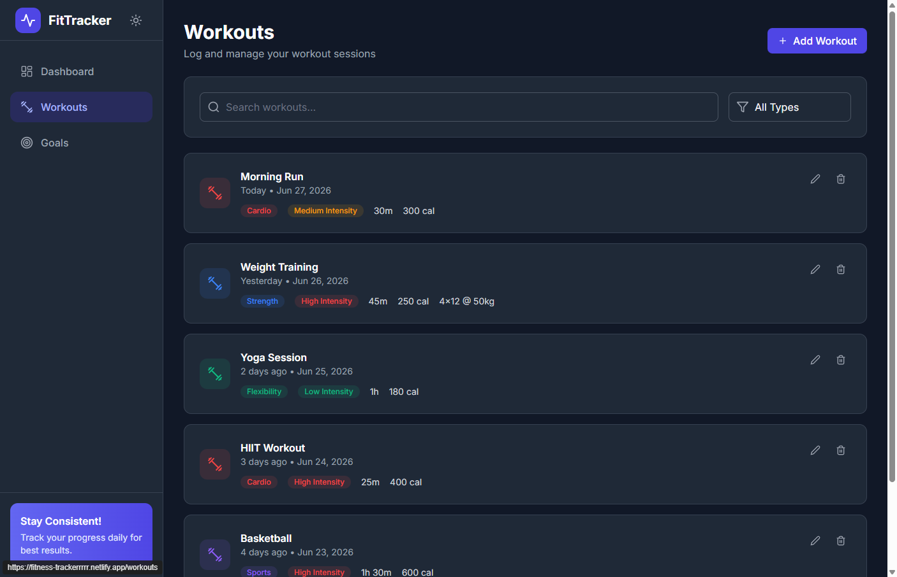
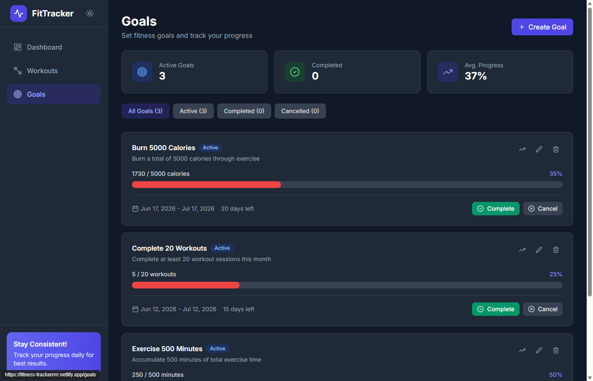

# 💪 Fitness Tracker

A modern, responsive web application for tracking workouts, setting fitness goals, and monitoring your progress with beautiful charts and analytics. Take control of your fitness journey!

[](https://serkanbayraktar.com/)
[](https://github.com/Serkanbyx)

## Features

- **Interactive Dashboard**: Get a complete overview of your fitness metrics with beautiful, interactive charts showing weekly activity, calorie burn, and exercise distribution
- **Workout Management**: Log, edit, and delete workout sessions with support for multiple exercise types including cardio, strength, flexibility, balance, and sports
- **Goal Setting & Tracking**: Create fitness goals with various target types (workout count, duration, calories, weight lifted) and track your progress visually
- **Automatic Goal Sync**: Active goals are automatically updated from your logged workouts, with the option to override progress manually and resume auto-tracking anytime
- **Smart Calorie Estimation**: Auto-calculate calories burned using scientific MET (Metabolic Equivalent of Task) values based on exercise type, intensity, and duration
- **Real-Time Statistics**: Monitor your workout streak, calories burned, total duration, and active goals at a glance
- **Dark / Light Theme**: Toggle between dark and light modes, with automatic system preference detection
- **Progressive Web App (PWA)**: Installable on desktop and mobile with offline support via service worker caching
- **Data Persistence**: Your data is automatically saved to local storage, so you never lose your progress
- **Responsive Design**: Fully optimized for desktop, tablet, and mobile devices with an intuitive navigation system

## Screenshots

### Dashboard

| Dark Mode | Light Mode |
| --- | --- |
|  |  |

### Workouts



### Goals



## Live Demo

[🚀 View Live Demo](https://fitness-trackerrrrr.netlify.app/dashboard)

## Technologies

- **React 18**: Modern React with hooks for building interactive user interfaces
- **TypeScript**: Type-safe development for better code quality and maintainability
- **Vite 5**: Next-generation frontend build tool for lightning-fast development
- **Zustand**: Lightweight state management with built-in persistence
- **React Hook Form**: Performant form handling with easy validation
- **Zod**: TypeScript-first schema validation for robust data handling
- **Tailwind CSS**: Utility-first CSS framework for rapid UI development
- **Recharts**: Composable charting library for React
- **Lucide React**: Beautiful, customizable icons
- **React Router v6**: Declarative routing for React applications
- **Vitest & Testing Library**: Fast unit testing with a component-focused testing approach
- **vite-plugin-pwa**: Zero-config Progressive Web App support

## Installation

### Prerequisites

- Node.js 18 or higher
- npm or yarn package manager

### Local Development

1. Clone the repository:

```bash
git clone https://github.com/Serkanbyx/fitness-tracker.git
cd fitness-tracker
```

2. Install dependencies:

```bash
npm install
```

3. Start the development server:

```bash
npm run dev
```

4. Open your browser and navigate to `http://localhost:3000`

### Build for Production

```bash
npm run build
```

The optimized production files will be generated in the `dist` directory.

### Preview Production Build

```bash
npm run preview
```

### Run Tests

```bash
# Run the full test suite once
npm run test:run

# Run tests in watch mode
npm run test

# Generate a coverage report
npm run test:coverage
```

## Usage

1. **Dashboard**: Start by viewing the dashboard to see your overall fitness statistics and charts
2. **Add Workouts**: Navigate to the Workouts page and click "Add Workout" to log a new exercise session
3. **Set Goals**: Go to the Goals page and create fitness goals with specific targets and deadlines
4. **Track Progress**: Monitor your progress through the dashboard charts and goal progress bars
5. **Manage Data**: Edit or delete workouts and goals as needed to keep your data accurate
6. **Switch Theme**: Use the theme toggle in the navigation to switch between light and dark mode

## How It Works?

### State Management

The application uses Zustand for efficient state management with localStorage persistence:

```typescript
// Workout store with persistence
export const useWorkoutStore = create<WorkoutState & WorkoutActions>()(
  devtools(
    persist(
      (set, get) => ({
        workouts: [],
        addWorkout: (data) => {
          // ... add workout and sync related goals
        },
      }),
      { name: 'fitness-tracker-workouts', version: 1 }
    ),
    { name: 'WorkoutStore' }
  )
);
```

### Automatic Goal Tracking

When you add, update, or delete a workout, all active goals are recalculated from your workout data automatically. Manually adjusting a goal's progress marks it as "manual" and excludes it from auto-sync until you choose to resume automatic tracking:

```typescript
syncGoalsWithWorkouts: (workouts: Workout[]) => {
  // Skip goals that are not active or are manually tracked
  if (goal.status !== 'active' || goal.isManualProgress) return goal;
  // ... recalculate currentValue based on the goal's target type
};
```

### Smart Calorie Estimation

Calories are estimated using the standard MET formula:

```typescript
// Calories = MET × Weight(kg) × Duration(hours)
export const calculateCalories = (
  exerciseType: ExerciseType,
  intensity: IntensityLevel,
  durationMinutes: number,
  bodyWeight: number = 70
): number => {
  const met = metValues[exerciseType]?.[intensity] ?? 5.0;
  return Math.round(met * bodyWeight * (durationMinutes / 60));
};
```

### Form Validation

Forms are validated using Zod schemas for type-safe data handling:

```typescript
const workoutSchema = z.object({
  exerciseType: z.enum(['cardio', 'strength', 'flexibility', 'balance', 'sports']),
  duration: z.number().positive('Duration must be greater than 0'),
  calories: z.number().positive('Calories must be greater than 0'),
  // ... more validations
});
```

### Data Visualization

The Recharts library powers the interactive charts on the dashboard:

```typescript
<AreaChart data={weeklyData}>
  <XAxis dataKey="day" />
  <YAxis />
  <Tooltip />
  <Area type="monotone" dataKey="calories" fill="#6366f1" />
</AreaChart>
```

## Project Structure

```
src/
├── components/
│   ├── forms/           # Form components (WorkoutForm, GoalForm)
│   ├── ui/              # Reusable UI components (Button, Modal, StatsCard, ProgressBar, EmptyState)
│   ├── Layout.tsx       # Main layout with navigation and footer
│   ├── Sidebar.tsx      # Desktop navigation sidebar with theme toggle
│   ├── MobileNav.tsx    # Mobile bottom navigation bar
│   └── ErrorBoundary.tsx# Global error boundary with recovery options
├── lib/
│   ├── utils.ts         # Utility functions, MET values, formatters, streak logic
│   └── validations.ts   # Zod validation schemas
├── pages/
│   ├── Dashboard.tsx    # Dashboard with charts and statistics
│   ├── Workouts.tsx     # Workout management page
│   └── Goals.tsx        # Goals management page
├── store/
│   ├── workoutStore.ts  # Zustand store for workouts
│   ├── goalStore.ts     # Zustand store for goals
│   └── themeStore.ts    # Zustand store for theme (dark/light/system)
├── types/
│   └── index.ts         # TypeScript type definitions
├── test/
│   └── setup.ts         # Vitest test setup
├── App.tsx              # Main app component with routing
├── main.tsx             # Application entry point
└── index.css            # Global styles with Tailwind
```

## Customization

### Adjust Body Weight for Calorie Calculation

The MET-based calorie estimation uses a default body weight. You can change it in `src/lib/utils.ts`:

```typescript
const DEFAULT_BODY_WEIGHT = 70; // kg
```

### Add Your Own Exercise Type Colors

Exercise type labels and colors are defined in `src/lib/utils.ts`:

```typescript
export const exerciseTypeConfig: Record<ExerciseType, { label: string; color: string }> = {
  cardio: { label: 'Cardio', color: '#ef4444' },
  strength: { label: 'Strength', color: '#3b82f6' },
  // ... add or customize types
};
```

### Change the Theme Colors

Primary and accent color palettes can be customized in `tailwind.config.js`:

```javascript
theme: {
  extend: {
    colors: {
      primary: { /* your indigo palette */ },
      accent: { /* your emerald palette */ },
    },
  },
}
```

## Features in Detail

### Completed Features

✅ Interactive dashboard with weekly activity charts
✅ Workout logging with multiple exercise types
✅ Goal creation with progress tracking
✅ Automatic goal sync with manual override option
✅ MET-based automatic calorie estimation
✅ Data persistence with localStorage
✅ Responsive mobile-first design
✅ Form validation with error messages
✅ Filter and search functionality
✅ Workout streak tracking
✅ Dark / light theme with system detection
✅ Progressive Web App (PWA) support
✅ Unit tests with Vitest

### Future Features

🔮 User authentication and cloud sync
🔮 Export data to CSV/PDF
🔮 Social sharing and challenges
🔮 Workout templates and presets
🔮 Push notifications for goals
🔮 Integration with fitness devices

## Documentation

- [Build Guide](docs/build-guide.md) — the original step-by-step playbook used to build this project, including architecture, phases, and appendices.

## Contributing

Contributions are welcome! Please read our [Contributing Guide](.github/CONTRIBUTING.md) and [Code of Conduct](.github/CODE_OF_CONDUCT.md) before getting started.

1. Fork the repository
2. Create your feature branch:

```bash
git checkout -b feature/amazing-feature
```

3. Commit your changes with semantic messages:

```bash
git commit -m "feat: add amazing feature"
```

**Commit message prefixes:**

| Prefix      | Description           |
| ----------- | --------------------- |
| `feat:`     | New feature           |
| `fix:`      | Bug fix               |
| `docs:`     | Documentation changes |
| `style:`    | Code style changes    |
| `refactor:` | Code refactoring      |
| `test:`     | Adding tests          |
| `chore:`    | Maintenance tasks     |

4. Push to the branch:

```bash
git push origin feature/amazing-feature
```

5. Open a Pull Request

## License

This project is licensed under the MIT License - see the [LICENSE](LICENSE) file for details.

## Developer

**Serkanby**

- 🌐 Website: [serkanbayraktar.com](https://serkanbayraktar.com/)
- 💻 GitHub: [@Serkanbyx](https://github.com/Serkanbyx)
- 📧 Email: [serkanbyx1@gmail.com](mailto:serkanbyx1@gmail.com)

## Acknowledgments

- [React](https://react.dev/) - The library for web and native user interfaces
- [Tailwind CSS](https://tailwindcss.com/) - A utility-first CSS framework
- [Zustand](https://zustand-demo.pmnd.rs/) - Bear necessities for state management
- [Recharts](https://recharts.org/) - Redefined chart library built with React
- [Lucide](https://lucide.dev/) - Beautiful & consistent icons
- [Vite](https://vitejs.dev/) - Next Generation Frontend Tooling

## Contact

Have questions or suggestions? Feel free to reach out!

- 📝 [Open an Issue](https://github.com/Serkanbyx/fitness-tracker/issues)
- 📧 Email: [serkanbyx1@gmail.com](mailto:serkanbyx1@gmail.com)
- 🌐 Website: [serkanbayraktar.com](https://serkanbayraktar.com/)

---

⭐ If you like this project, don't forget to give it a star!
