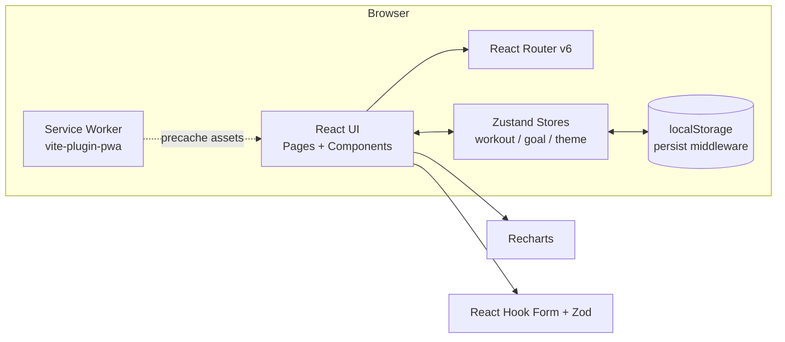

# Fitness Tracker — Step-by-Step Build Guide

> **Archived: original build playbook.** This document is the original roadmap used to build the Fitness Tracker application. It captures the intended order of work, the decisions behind each layer, and the acceptance criteria for every step. The codebase may have evolved since this guide was written, so treat it as a making-of narrative rather than the source of truth. For current setup, architecture, and deployment notes, see [../README.md](../README.md).

---

> **Project Summary:** Fitness Tracker is a fully client-side single-page application for logging workouts, defining fitness goals, and visualizing progress. There is no backend — all data is persisted to the browser via `localStorage` through Zustand's `persist` middleware. Core features include an analytics dashboard (weekly activity, duration, and exercise-type distribution charts), full CRUD for workouts and goals, automatic goal progress synchronization from workout data with an optional manual override, MET-based calorie estimation, workout streak tracking, dark/light theming with system detection, and installable PWA support with offline caching. The stack is React 18, TypeScript, Vite 5, Zustand, React Hook Form, Zod, Tailwind CSS, Recharts, and Vitest.

Each step below is a self-contained prompt. Execute them in order.

Stack: React 18 + TypeScript + Vite 5, Zustand (state + persist), React Hook Form + Zod (forms/validation), Tailwind CSS, Recharts, Lucide React, React Router v6, vite-plugin-pwa, Vitest + Testing Library.

---

## Table of Contents

**PHASE 1 — Project Foundation**

- STEP 1 — Project Scaffolding & Dependency Setup
- STEP 2 — Tooling: TypeScript, ESLint, Tailwind, PostCSS
- STEP 3 — Domain Types & Global Styles

**PHASE 2 — State & Domain Logic**

- STEP 4 — Utility Layer (MET Calories, Formatters, Streak)
- STEP 5 — Validation Schemas (Zod)
- STEP 6 — Zustand Stores (Workouts, Goals, Theme)

**PHASE 3 — UI Foundation**

- STEP 7 — Reusable UI Primitives
- STEP 8 — Layout, Navigation & Theme Toggle
- STEP 9 — Form Components

**PHASE 4 — Application Pages**

- STEP 10 — Dashboard Page
- STEP 11 — Workouts Page
- STEP 12 — Goals Page

**PHASE 5 — Polish & Deploy**

- STEP 13 — Error Boundary & App Composition
- STEP 14 — Progressive Web App (PWA)
- STEP 15 — Testing with Vitest
- STEP 16 — Build & Deployment

**Appendices**

- Appendix A — Shared Constants
- Appendix B — Reusable Patterns
- Appendix C — Common Pitfalls
- Appendix D — Pre-Flight Checklist

---

## Global Build Rules (apply to EVERY step)

- **No git operations.** Do not run `git` commands, do not commit, and do not push. Version control is handled manually by the user.
- Do not install unapproved packages. Stick to the dependency set defined in STEP 1 unless a step explicitly adds one.
- Do not run long-running processes (dev servers, watchers) unless the user explicitly requests it.
- Treat every step as self-contained: it states its goal, the files it touches, and a clear acceptance check.
- Prefer modern syntax: ES6+, React Hooks, `async/await`, and the existing local patterns.
- Keep names in English and `camelCase`; components in `PascalCase`.
- Prioritize accessibility (`aria-*`, semantic roles), performance (memoization where it matters), and type safety (no implicit `any`).
- Run `npm run lint` and `npm run build` before considering a phase complete.

---

## Architecture at a Glance



Key relationships:

- **Pages** read and mutate domain data exclusively through Zustand stores; they never touch `localStorage` directly.
- **`workoutStore`** drives **`goalStore`**: any workout mutation calls `syncGoalsWithWorkouts` so active goals recalculate from workout data.
- **`themeStore`** toggles the `dark` class on `document.documentElement` and persists the preference.
- **vite-plugin-pwa** generates the service worker and web manifest at build time; the app remains fully functional offline after first load.

---

# PHASE 1 — PROJECT FOUNDATION

---

## STEP 1 — Project Scaffolding & Dependency Setup

**Goal:** Create a Vite + React + TypeScript project and install the runtime and dev dependencies.

**Files/folders:**

- `package.json`, `index.html`, `vite.config.ts`, `src/main.tsx`, `src/App.tsx`

**Commands (run only if the user asks to scaffold):**

```bash
npm create vite@latest fitness-tracker -- --template react-ts
cd fitness-tracker
```

**Runtime dependencies:**

```bash
npm install zustand react-router-dom react-hook-form zod @hookform/resolvers recharts lucide-react clsx uuid
```

**Dev dependencies:**

```bash
npm install -D tailwindcss postcss autoprefixer vite-plugin-pwa vitest @vitest/coverage-v8 jsdom \
  @testing-library/react @testing-library/jest-dom @testing-library/user-event \
  @types/uuid eslint @typescript-eslint/eslint-plugin @typescript-eslint/parser \
  eslint-plugin-react-hooks eslint-plugin-react-refresh
```

**Scripts** (in `package.json`):

```json
{
  "scripts": {
    "dev": "vite",
    "build": "tsc && vite build",
    "lint": "eslint . --ext ts,tsx --report-unused-disable-directives --max-warnings 0",
    "preview": "vite preview",
    "test": "vitest",
    "test:run": "vitest run",
    "test:coverage": "vitest run --coverage"
  }
}
```

**Acceptance:** `npm run dev` serves a blank React app on `http://localhost:3000`.

---

## STEP 2 — Tooling: TypeScript, ESLint, Tailwind, PostCSS

**Goal:** Configure strict TypeScript, a working ESLint setup, and Tailwind with the project's brand palette.

**Files/folders:**

- `tsconfig.json`, `tsconfig.node.json`, `.eslintrc.cjs`, `tailwind.config.js`, `postcss.config.js`

**Implementation notes:**

- `tsconfig.json`: enable `strict`, `noUnusedLocals`, `noUnusedParameters`, `noFallthroughCasesInSwitch`, `jsx: react-jsx`, `moduleResolution: bundler`, and a `@/*` path alias to `src/*`. Exclude test files from the production `tsc` pass.
- `.eslintrc.cjs`: extend `eslint:recommended`, `plugin:@typescript-eslint/recommended`, `plugin:react-hooks/recommended`; add the `react-refresh` plugin; ignore `dist`, `dev-dist`, `coverage`. Disable `@typescript-eslint/no-explicit-any` in test overrides. The `lint` script uses `--max-warnings 0`, so the config must be clean.
- `tailwind.config.js`: set `darkMode: 'class'`, `content` globs for `index.html` and `src/**/*.{js,ts,jsx,tsx}`, and extend `colors` with `primary` (indigo) and `accent` (emerald) palettes plus the `Inter` font family.

**Acceptance:** `npm run lint` exits 0; Tailwind classes compile.

---

## STEP 3 — Domain Types & Global Styles

**Goal:** Define the shared domain model and the global Tailwind layer.

**Files/folders:**

- `src/types/index.ts`, `src/index.css`, `src/vite-env.d.ts`

**Implementation notes:**

- `types/index.ts` exports the core unions and interfaces: `ExerciseType`, `IntensityLevel`, `GoalStatus`, `GoalTargetType`, `Workout`, `Goal` (including the optional `isManualProgress` flag), `DashboardStats`, `WeeklySummary`, and `ExerciseDistribution`.
- `index.css` declares `@tailwind base/components/utilities` and component classes used across the app: `.card`, `.input`, `.input-error`, `.label`, `.error-message`, `.page-title`, `.section-title`, `.sign` (footer), and a `fadeIn` animation utility. Define tooltip CSS variables for light and dark.

**Acceptance:** Types import cleanly anywhere; shared utility classes render in both themes.

---

# PHASE 2 — STATE & DOMAIN LOGIC

---

## STEP 4 — Utility Layer (MET Calories, Formatters, Streak)

**Goal:** Centralize pure helper logic with no React dependencies.

**Files/folders:**

- `src/lib/utils.ts`

**Implementation notes:**

- `metValues`: a `Record<ExerciseType, Record<IntensityLevel, number>>` of MET constants (see Appendix A).
- `calculateCalories(type, intensity, minutes, bodyWeight = 70)`: implements `MET × weight(kg) × hours`.
- `calculateStrengthCalories(...)`: base strength calories plus a weight factor and a volume (sets × reps) factor.
- Display configs: `exerciseTypeConfig`, `intensityConfig`, `goalTargetConfig` (labels, colors, units).
- Formatters: `formatDate`, `formatRelativeDate`, `formatDuration`, `getDayNames`, `getCurrentWeekRange`, `getTodayString`, `truncateText`.
- `calculateStreak(workouts)`: counts consecutive workout days from today, allowing a one-day grace gap.

**Acceptance:** Pure functions are unit-testable and have no side effects.

---

## STEP 5 — Validation Schemas (Zod)

**Goal:** Define type-safe form validation contracts.

**Files/folders:**

- `src/lib/validations.ts`

**Implementation notes:**

- `workoutSchema`: validates `name` (2–50), `exerciseType` enum, `duration` (positive, ≤ 600), `calories` (positive, ≤ 10000), optional `sets`/`reps`/`weight` (nullable, transformed to `undefined`), `intensity` enum, optional `notes` (≤ 500), required `date`.
- `goalSchema`: validates `title` (2–100), optional `description` (≤ 500), `targetType` enum, `targetValue` (positive), `startDate`/`endDate`; add a `.refine` ensuring `endDate > startDate`.
- Export inferred types `WorkoutFormData` and `GoalFormData` via `z.infer`.

**Acceptance:** Schemas reject invalid input with friendly messages; inferred types match the form fields.

---

## STEP 6 — Zustand Stores (Workouts, Goals, Theme)

**Goal:** Implement persisted, devtools-wrapped stores and the cross-store sync behavior.

**Files/folders:**

- `src/store/workoutStore.ts`, `src/store/goalStore.ts`, `src/store/themeStore.ts`, `src/store/index.ts`

**Implementation notes:**

- Wrap each store with `devtools(persist(...))`. Use distinct persist keys: `fitness-tracker-workouts`, `fitness-tracker-goals`, `fitness-tracker-theme`.
- `workoutStore`: state (`workouts`, `isLoading`, `error`) plus actions `addWorkout`, `updateWorkout`, `deleteWorkout`, getters, and `getTotalStats`. After any mutation, call `useGoalStore.getState().syncGoalsWithWorkouts(get().workouts)`.
- `goalStore`: CRUD plus `updateProgress`, `enableAutoTracking`, `completeGoal`, `cancelGoal`, `reactivateGoal`, `getGoalProgress`, and `syncGoalsWithWorkouts`.
  - `updateProgress` sets `isManualProgress: true` so the goal is excluded from auto-sync.
  - `syncGoalsWithWorkouts` recalculates `currentValue` per target type **only** for active, non-manual goals.
  - `enableAutoTracking(id, workouts)` clears the manual flag and re-runs the sync.
- `themeStore`: `theme` (`light | dark | system`) and `resolvedTheme`; apply the `dark` class to `documentElement`, rehydrate on load, and listen for OS `prefers-color-scheme` changes.

**Implementation note — circular dependency:** `workoutStore` imports `goalStore` for syncing. Keep `goalStore` free of any import from `workoutStore`; pass `workouts` into `syncGoalsWithWorkouts`/`enableAutoTracking` as arguments instead.

**Acceptance:** Adding a workout updates relevant active goals; a manually edited goal keeps its value until auto-tracking is re-enabled; theme persists across reloads.

---

# PHASE 3 — UI FOUNDATION

---

## STEP 7 — Reusable UI Primitives

**Goal:** Build the shared component library used by every page.

**Files/folders:**

- `src/components/ui/Button.tsx`, `Modal.tsx`, `StatsCard.tsx`, `ProgressBar.tsx`, `EmptyState.tsx`, `index.ts`

**Implementation notes:**

- `Button`: `forwardRef`, variants (`primary | secondary | success | danger | ghost`), sizes, `isLoading` spinner, `leftIcon`/`rightIcon`. Secondary and ghost variants must include `dark:` classes.
- `Modal`: portal-free overlay with `role="dialog"`, `aria-modal`, Escape-to-close, body scroll lock, click-outside-to-close, and size variants.
- `StatsCard`: title, value, subtitle, icon, optional trend, color variants (all with dark variants).
- `ProgressBar`: clamped percentage, auto color by completion, `role="progressbar"` with `aria-valuenow/min/max`, dark track.
- `EmptyState`: icon, title, description, optional action button; dark-aware.

**Acceptance:** Components render correctly in light and dark mode and pass accessibility checks.

---

## STEP 8 — Layout, Navigation & Theme Toggle

**Goal:** Compose the responsive shell with desktop sidebar and mobile bottom nav.

**Files/folders:**

- `src/components/Layout.tsx`, `Sidebar.tsx`, `MobileNav.tsx`

**Implementation notes:**

- `Layout`: fixed sidebar offset (`lg:ml-64`), centered content container, `Outlet`, and a signature footer.
- `Sidebar` (desktop): brand, `NavLink`s with active styles via `clsx`, and a theme toggle button (`Sun`/`Moon`).
- `MobileNav` (mobile): bottom tab bar with the same links plus a theme toggle.

**Acceptance:** Navigation works on desktop and mobile; the active route is highlighted; theme toggling is reachable in both layouts.

---

## STEP 9 — Form Components

**Goal:** Build validated forms wired to Zod resolvers.

**Files/folders:**

- `src/components/forms/WorkoutForm.tsx`, `GoalForm.tsx`, `index.ts`

**Implementation notes:**

- Use `useForm` with `zodResolver`. Register numeric inputs with `{ valueAsNumber: true }`.
- `WorkoutForm`: conditional strength fields (`sets/reps/weight`) shown only when `exerciseType === 'strength'`; an auto-calculate button that calls the MET helpers and `setValue('calories', ...)`.
- `GoalForm`: target-type-aware unit hints; default end date 30 days out.
- Support an `initialData` prop for edit mode and an `isSubmitting` flag.

**Acceptance:** Invalid submissions show inline errors; valid submissions emit a typed payload to the parent.

---

# PHASE 4 — APPLICATION PAGES

---

## STEP 10 — Dashboard Page

**Goal:** Present aggregate stats and charts.

**Files/folders:**

- `src/pages/Dashboard.tsx`

**Implementation notes:**

- Derive all view data with `useMemo`: total stats, weekly summary (current week buckets), exercise-type distribution, and the first three active goals.
- Render six `StatsCard`s and four chart panels: `AreaChart` (weekly calories), `BarChart` (duration by day), `PieChart` (exercise distribution), and an active-goals progress list. Wrap charts in `ResponsiveContainer`.
- Show an empty state when there is no workout data.

**Acceptance:** Charts react live to store changes; no layout shift on empty data.

---

## STEP 11 — Workouts Page

**Goal:** Full workout CRUD with search and type filtering.

**Files/folders:**

- `src/pages/Workouts.tsx`

**Implementation notes:**

- Search by name and filter by exercise type with `useMemo`; sort newest first.
- Add/edit via a `Modal` + `WorkoutForm`; delete via a confirmation `Modal`.
- Extract a `WorkoutCard` subcomponent with type/intensity badges, formatted duration/calories, optional sets×reps×weight, and notes. Provide separate desktop and mobile action affordances.

**Acceptance:** Create, edit, delete all work and persist; filters narrow the list correctly; empty state adapts to whether filters are active.

---

## STEP 12 — Goals Page

**Goal:** Goal CRUD, status workflow, and manual/auto progress.

**Files/folders:**

- `src/pages/Goals.tsx`

**Implementation notes:**

- Status filter tabs (`all/active/completed/cancelled`) with counts; sort active first, then by creation date.
- Summary cards: active count, completed count, average progress.
- `GoalCard`: status badge, a `Manual` badge when `isManualProgress`, progress bar, days-remaining indicator, and contextual actions (`Update Progress`, `Resume auto-tracking`, `Complete`, `Cancel`, `Reactivate`).
- The progress modal warns that manual updates pause automatic tracking. Resuming auto-tracking calls `enableAutoTracking(id, workouts)` with workouts from `useWorkoutStore`.
- Apply `dark:` variants throughout this page (it is the most style-heavy).

**Acceptance:** Manual progress survives workout mutations; the resume button restores auto-sync; all status transitions work.

---

# PHASE 5 — POLISH & DEPLOY

---

## STEP 13 — Error Boundary & App Composition

**Goal:** Add resilient error handling and wire routing.

**Files/folders:**

- `src/components/ErrorBoundary.tsx`, `src/App.tsx`, `src/main.tsx`

**Implementation notes:**

- `ErrorBoundary` (class component): `getDerivedStateFromError`, `componentDidCatch` (log only in DEV), and a dark-aware fallback UI with "Try Again", "Go to Dashboard", and "Reload" actions.
- `App`: declare routes under `Layout`; redirect `/` and unknown paths to `/dashboard`.
- `main.tsx`: render `StrictMode > ErrorBoundary > BrowserRouter > App` and import `index.css`.

**Acceptance:** A thrown render error shows the fallback instead of a blank screen; routing redirects behave as specified.

---

## STEP 14 — Progressive Web App (PWA)

**Goal:** Make the app installable and offline-capable.

**Files/folders:**

- `vite.config.ts`, `public/manifest.json`, `public/icons/icon.svg`, `index.html`

**Implementation notes:**

- Configure `VitePWA` with `registerType: 'autoUpdate'`, a manifest (name, theme/background color, display `standalone`), Workbox `globPatterns`, and runtime caching for Google Fonts.
- Reference icons that actually exist. The project ships a single scalable `icons/icon.svg`; manifest and `index.html` (`apple-touch-icon`, favicon) point to it with `type: image/svg+xml` and `sizes: any`. Do not reference PNG sizes that are not present.

**Acceptance:** `npm run build` emits `manifest.webmanifest` and a service worker with no missing-asset 404s.

---

## STEP 15 — Testing with Vitest

**Goal:** Lock behavior with unit and component tests.

**Files/folders:**

- `src/test/setup.ts`, `src/store/workoutStore.test.ts`, `src/components/ui/Button.test.tsx`, `src/components/ErrorBoundary.test.tsx`

**Implementation notes:**

- Configure Vitest in `vite.config.ts`: `globals: true`, `environment: 'jsdom'`, `setupFiles`, coverage via `v8`.
- `setup.ts` imports `@testing-library/jest-dom`.
- Store tests reset state in `beforeEach` and mock `goalStore` to avoid the cross-store dependency.
- Component tests use Testing Library queries and assert on roles/text.

**Acceptance:** `npm run test:run` is green; coverage report generates.

---

## STEP 16 — Build & Deployment

**Goal:** Produce a production bundle and deploy as a static site.

**Files/folders:**

- `netlify.toml`, `dist/` (generated), `.gitignore`

**Implementation notes:**

- `netlify.toml`: set the build command to `npm run build`, publish `dist`, and add an SPA redirect (`/* -> /index.html` 200) so client-side routes resolve.
- Ensure `.gitignore` excludes `node_modules`, `dist`, `dev-dist`, and `coverage`.
- Optional: address the Recharts-driven chunk-size warning with `build.rollupOptions.output.manualChunks` or dynamic imports.

**Acceptance:** `npm run build` succeeds; the `dist` output runs via `npm run preview`; deep links resolve on the host.

---

# Appendix A — Shared Constants

**MET values** (`src/lib/utils.ts`):

```typescript
export const metValues: Record<ExerciseType, Record<IntensityLevel, number>> = {
  cardio:      { low: 4.0, medium: 7.0, high: 10.0 },
  strength:    { low: 3.0, medium: 5.0, high: 6.0 },
  flexibility: { low: 2.5, medium: 3.0, high: 4.0 },
  balance:     { low: 2.0, medium: 3.0, high: 4.5 },
  sports:      { low: 4.0, medium: 6.0, high: 9.0 },
};

const DEFAULT_BODY_WEIGHT = 70; // kg
```

**Persist keys:** `fitness-tracker-workouts`, `fitness-tracker-goals`, `fitness-tracker-theme`.

**Brand palette:** `primary` = indigo scale (`#6366f1` / `#4f46e5`), `accent` = emerald scale (`#10b981` / `#059669`).

---

# Appendix B — Reusable Patterns

- **Derived view data:** compute charts, filters, and aggregates with `useMemo` keyed on the relevant store slices; never store derived data.
- **Store-as-source-of-truth:** components never read or write `localStorage` directly; the `persist` middleware owns persistence.
- **Cross-store sync via arguments:** pass `workouts` into goal-store functions to avoid a circular import between stores.
- **Class merging:** use `clsx` for conditional and variant class composition.
- **Dark mode:** every color utility ships a `dark:` counterpart; the `dark` class is toggled on `documentElement` by `themeStore`.

---

# Appendix C — Common Pitfalls

- **Missing PWA icons:** referencing PNG sizes that do not exist produces 404s and breaks install. Reference only assets that ship (the single `icon.svg`).
- **Manual vs. automatic goal progress:** without the `isManualProgress` flag, `syncGoalsWithWorkouts` silently overwrites a user's manual value on the next workout mutation. The flag (plus a resume action) resolves the conflict.
- **Circular store imports:** importing `workoutStore` inside `goalStore` (in addition to the reverse) causes initialization issues. Keep the dependency one-directional.
- **ESLint `--max-warnings 0`:** any warning fails CI/lint. Keep test-only `any` scoped via an ESLint override.
- **Incomplete dark mode:** style-heavy pages (Goals) and shared primitives (Button secondary/ghost, ProgressBar, EmptyState, ErrorBoundary) must each carry `dark:` variants, or they will look broken in dark mode.

---

# Appendix D — Pre-Flight Checklist

- [ ] `npm run lint` exits 0 with no warnings.
- [ ] `npm run test:run` is green.
- [ ] `npm run build` succeeds and emits the manifest and service worker.
- [ ] No console 404s for icons or manifest in production preview.
- [ ] Light and dark mode both render every page and primitive correctly.
- [ ] Workout mutations update active goals; manual goals are preserved.
- [ ] SPA deep links resolve on the deploy target.
- [ ] `.gitignore` excludes `node_modules`, `dist`, `dev-dist`, `coverage`.
